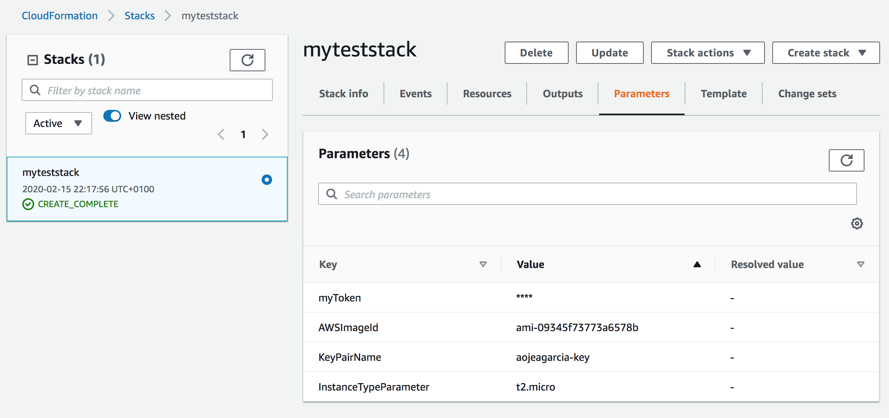

# k8s-aws-ipv6

Support for IPv6-only clusters was added in Kubernetes 1.9 as an alpha feature, allowing full Kubernetes capabilities using IPv6 networking instead of IPv4 networking.

The only missing part to graduate IPv6 to Beta is running Kubernetes IPv6 clusters in a Cloud Provider.

This document explains how to run an IPv6 conformance cluster in AWS using kubeadm: 1 control-plane + 2 workers, but it can be easily adapted to run more nodes.

It's out of scope to provide a mechanism to create a new installer for Kubernetes, there
are much better projects to do that:

* kops
* kubespray
* cluster-api

## Requirements: Fully baked instances

We are going to use the fully baked instances with all the necessary components preloaded:

You can find openSUSE Leap images ready to use in AWS: ami-09345f73773a6578b

If you are curious about how they are built, you can find the sources here:

https://build.opensuse.org/package/show/home:aojeagarcia:jeek8s/JeeK8S-Leap-15.1

There are also images on the Cluster API project too (still WIP)

https://github.com/kubernetes-sigs/image-builder/pull/97

If you want to create your own images, these are the requirements:

- IPv6 forwarding enabled and accept RA on the external interface

- All the Kubernetes components installed:
  kubelet, kubectl, kubeadm

- All the Kubernetes images preloaded:
  kube-controller-manager.tar kube-proxy.tar kube-scheduler.tar kube-apiserver.tar

- The CNI plugin install manifest and image preloaded:
  https://github.com/aojea/kindnet

## For the impatient

Just use the provided cloudformation stack in this repo to create an IPv6 cluster in AWS

You can use it from the cli, is only one command and you'll have 1 control-plane and 2 worker nodes:

```sh
aws cloudformation create-stack --stack-name myKubernetesIPv6Cluster \
    --template-body file://aws-k8s-ipv6.yaml \
    --parameters ParameterKey=KeyPairName,ParameterValue=aojeagarcia-key
```

or uring the AWS Console:



You can define your own Keypair, ImageId, InstanceType, and Kubeadm Token as parameters.

## The Hard Way

1. Create a VPC with IPv6 enabled
2. Create a Subnet/s with IPv6 autoassign by default
3. Configure Network ACLs to allow:
  NodePorts
  Pod and Service Subnets
  Host to Host

4. Add an Internet Gateway to the VPC
5. Configure the route table to use the Internet Gateway
6. Spwan instances

6.1 Use the fully-baked instances because some services like DockerHub and Github are not available with IPv6
6.2 Disable the SrcDestCheck attribute on the instances
6.3 Configure security groups to allow Pods and Services communication between the instances

## Creating the cluster with Kubeadm

**NOTE**: Kubelet node-ip autodiscovery pending https://github.com/kubernetes/kubernetes/pull/88164

Without this patch, you have to configure the kubelet node-ip to use the node IPv6 address adding
`--node-ip=NODE_IPV6_ADDRESS` in `/var/lib/kubelet/kubeadm-flags.env` and restarting the kubelet 
`systemctl restart kubelet`

Use the following Kubeadm configuration for the control plane node:

```yaml
---
apiVersion: kubeadm.k8s.io/v1beta2
kind: ClusterConfiguration
clusterName: ipv6-cluster
apiServer:
  extraArgs:
    bind-address: "::"
controllerManager:
  extraArgs:
    configure-cloud-routes: "false"
    bind-address: "::"
networking:
  podSubnet: fd00:10:244::/64
  serviceSubnet: fd00:10:96::/112
scheduler:
  extraArgs:
    address: "::"
    bind-address: "::1"
---
apiVersion: kubeadm.k8s.io/v1beta2
kind: InitConfiguration
metadata:
  name: config
# we use a well know token for TLS bootstrap
bootstrapTokens:
- token: ${Token}
# we use a well know port for making the API server discoverable inside docker network.
# from the host machine such port will be accessible via a random local port instead.
localAPIEndpoint:
  advertiseAddress: "::"
  bindPort: 6443
nodeRegistration:
  kubeletExtraArgs:
    fail-swap-on: "false"
    node-ip: "::"
---
apiVersion: kubelet.config.k8s.io/v1beta1
kind: KubeletConfiguration
metadata:
  name: config
# configure ipv6 addresses in IPv6 mode
address: "::"
healthzBindAddress: "::"
# disable disk resource management by default
# kubelet will see the host disk that the inner container runtime
# is ultimately backed by and attempt to recover disk space. we don't want that.
imageGCHighThresholdPercent: 100
evictionHard:
  nodefs.available: "0%"
  nodefs.inodesFree: "0%"
  imagefs.available: "0%"
```

init the control-plane nodes with kubeadm:

```sh
/usr/bin/kubeadm init --config /opt/kubeadm.yaml --ignore-preflight-errors=all -v7
```

Use the following Kubeadm configuration for the worker nodes:

```yaml
---
kind: JoinConfiguration
apiVersion: kubeadm.k8s.io/v1beta2
discovery:
  bootstrapToken:
    apiServerEndpoint: "${ApiServerIP}:6443"
    token: ${Token}
    unsafeSkipCAVerification: true
nodeRegistration:
  criSocket: /run/containerd/containerd.sock
  kubeletExtraArgs:
    fail-swap-on: "false"
    node-ip: "::"
```

and join the worker nodes:

```sh
/usr/bin/kubeadm init --config /opt/kubeadm.yaml --ignore-preflight-errors=all -v7
```

## CNI Plugin

You can choose any CNI plugin with IPv6 support, however, I prefer to use use [Kindnet](https://github.com/aojea/kindnet) as CNI plugin because it's simpler than any other plugin and an AWS subnet allows having all cluster nodes in the same L2 segment.

Because DockerHub and Github are not available in IPv6 there are 2 options:

1. Provide IPv4 internet connectivity to the instances

or

2. Upload the CNI artifacts to an IPv6 service, in this example I'm using Dropbox:

```sh
wget https://www.dropbox.com/s/yqxarzf8tj83y02/kindnetd.tar.gz -O- | gunzip | ctr --namespace=k8s.io images import --no-unpack -
https://www.dropbox.com/s/ma35vprq69h3ikw/install-kindnet.yaml
```

Because the install manifest doesn't specifiy the tag it uses `:latest`, that means it tries to pull it from internet, so we should tag them to use the local images first:

```sh
ctr --namespace=k8s.io images tag docker.io/aojea/kindnetd:latest docker.io/aojea/kindnetd:0.7.0
sed -i 's/aojea\/kindnetd/aojea\/kindnetd:0.7.0/' kindnet.yaml
```

and we can install the CNI now:

```sh
kubectl apply -f https://www.dropbox.com/s/ma35vprq69h3ikw/install-kindnet.yaml
```

## Verify it works

Once the nodes joined the cluster you can verify that they are ready with:

```
ip-192-168-0-110:~ # kubectl --kubeconfig /etc/kubernetes/admin.conf get nodes -o wide
NAME               STATUS   ROLES    AGE     VERSION                                   INTERNAL-IP                              EXTERNAL-IP   OS-IMAGE             KERNEL-VERSION                CONTAINER-RUNTIME
ip-192-168-0-110   Ready    master   16m     v1.18.0-alpha.5.32+b09b91f84eb9a7-dirty   2a05:d012:87f:5d01:dd0a:8a4:3f6f:669f    <none>        openSUSE Leap 15.1   4.12.14-lp151.28.36-default   containerd://1.3.3
ip-192-168-0-169   Ready    <none>   106s    v1.18.0-alpha.5.32+b09b91f84eb9a7-dirty   2a05:d012:87f:5d01:45f1:65e4:9fbd:b448   <none>        openSUSE Leap 15.1   4.12.14-lp151.28.36-default   containerd://1.3.3
ip-192-168-0-189   Ready    <none>   3m50s   v1.18.0-alpha.5.32+b09b91f84eb9a7-dirty   2a05:d012:87f:5d01:3a5e:9179:8afa:5475   <none>        openSUSE Leap 15.1   4.12.14-lp151.28.36-default   containerd://1.3.3
```

### Deploy a web application

```yaml
apiVersion: apps/v1
kind: Deployment
metadata:
  name: web
  namespace: default
spec:
  selector:
    matchLabels:
      run: web
  template:
    metadata:
      labels:
        run: web
    spec:
      containers:
      - image: gcr.io/google-samples/hello-app:1.0
        imagePullPolicy: IfNotPresent
        name: web
        ports:
        - containerPort: 8080
          protocol: TCP
```

```sh
kubectl apply -f web-deployment.yaml
```

### Expose your Deployment as a Service

```yaml
apiVersion: v1
kind: Service
metadata:
  name: web
  namespace: default
spec:
  ports:
  - port: 8080
    protocol: TCP
    targetPort: 8080
  selector:
    run: web
  type: NodePort
```

```sh
kubectl apply -f web-service.yaml
```

IPv6 addresses are public, that means that you don't need a LoadBalancer and you can access the service using one of the nodes public IPv6 addresses.

```sh
curl http://[MY_NODE_IPV6]:8080
```

## References

- https://itnext.io/how-to-run-ipv6-enabled-docker-containers-on-aws-87e090ab0397
- https://gist.githubusercontent.com/milesjordan/d86942718f8d4dc20f9f331913e7367a/raw/3227d1dff6e9df8a79f395cdb2c62af9899ed777/vpc.yaml
- https://blog.scottlowe.org/2019/02/18/kubernetes-kubeadm-and-the-aws-cloud-provider/
- https://docs.aws.amazon.com/vpc/latest/userguide/vpc-migrate-ipv6.html
- https://docs.aws.amazon.com/vpc/latest/userguide/egress-only-internet-gateway.html
- https://gist.github.com/milesjordan/d86942718f8d4dc20f9f331913e7367a
- https://github.com/aws-quickstart/quickstart-vmware

## TODO

- [ ] Use the AWS Cloud provider
  https://github.com/kubernetes/cloud-provider-aws
- [ ] Cluster HA configuration
- [ ] Autoscale workers
- [ ] Explore Load Balancer alternatives to expose services due to the amount of public addresses we have now